<h4 align="center"> 
	🚧 Sushibar 🚀
</h4>

<p align="center" style="display: flex; align-items: flex-start; justify-content: center;">
  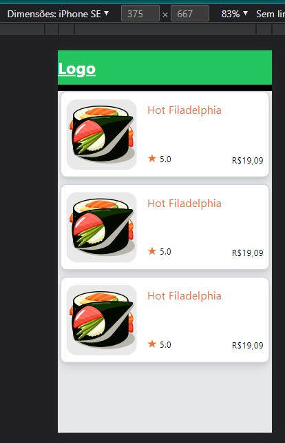
</p>  

## Getting Started

First, run the development server:

```bash
npm run dev
# or
yarn dev
```

Open [http://localhost:3000](http://localhost:3000) with your browser to see the result.

### Learn More

- [Next.js Documentation](https://nextjs.org/docs) - learn about Next.js features and API.

- You can check out [the Next.js GitHub repository](https://github.com/vercel/next.js/) - your feedback and contributions are welcome!

## Layout

- Design no [Figma](https://www.figma.com/file/UiLvyL3UxGZt15t0IDcP80/Sushibar?node-id=0%3A1&t=zffdeG1GjpNHWrwe-0)

## Components

Criado a branch components para desenvolver

- ProductBox
- ProductMenu
- ProductListItem
- ProductOptionSelected
- ProductHamburguerMenu

### Components Templates

<p align="center" style="display: flex; align-items: flex-start; justify-content: center;">
  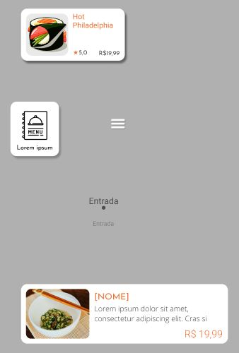
</p>  

### Anotações do ProductBox Component 

- [x] Construir componente conforme design figma
- [x] img 100% com div e adicionar border radius
- [x] Adicionar Título
- [x] Adicionar favicon personalizado
- [x] Adicionar detalhes no readme

### Anotações do ProductMenu Component 

- [x] Construir componente conforme design figma
- [x] Separado o componente corretamente

### Anotações do ProductListItem Component 

- [x] Remover o id
- [ ] ajustar o tamanho da imagem

### Anotações do ProductOptionSelected Component 

- [x] Construir componente conforme design figma

### Anotações do ProductHamburguerMenu Component 

- [x] Construir componente conforme design figma

### Componentes

<p align="center" style="display: flex; align-items: flex-start; justify-content: center;">
  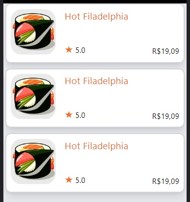
  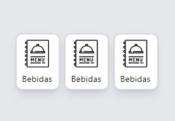
  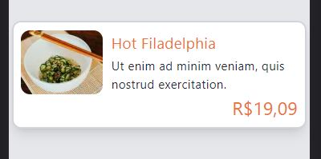
  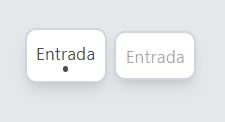
  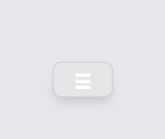
</p>  

## Pages

Criado a branch components para desenvolver

- Home
- Cardápio 
- Bebidas
- Nosso Espaço  

### Pages Templates

<p align="center" style="display: flex; align-items: flex-start; justify-content: center;">
  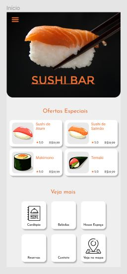
  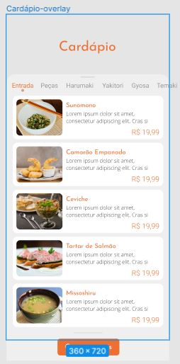
  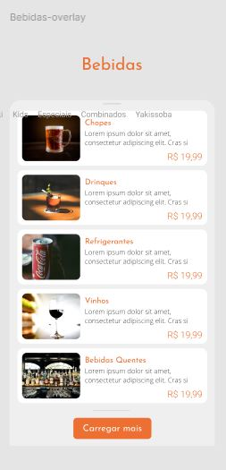
  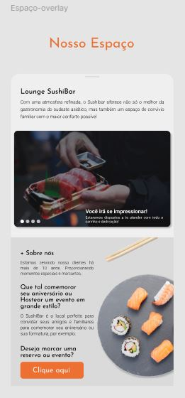
</p>  

### Anotações da Index Page 

- [x] Construir página conforme design figma
- [x] fazendo a grid de ofertas especiais com tamanho de image
- [x] space-between das informações e titulo
- [x] justify-content: center no título do grid
- [x] background colorida da imagem
- [x] dimensões da grid da sessão veja mais
- [x] 3 botões para as páginas
- [ ] background imagem na sessão ofertas especiais

### Anotações da Cardápio Page 

- [x] Construir página conforme design figma 
- [x] Botão carregar mais
- [x] Construir layout menu: botões clicáveis, Filtrar por categoria, useMemo
- [ ] Aperfeiçoar botão return para home
- [ ] background imagem nos cards

### Anotações da Bebidas Page 

- [x] Construir página conforme design figma
- [x] Botão carregar mais
- [x] Construir layout menu: botões clicáveis, Filtrar por categoria, useMemo
- [ ] Aperfeiçoar botão return para home
- [ ] background imagem nos cards

### Anotações da Nosso Espaço Page 

- [x] Construir página conforme design figma
- [x] Criado os elementos em tela
- [x] Estilizar e posicionar
- [x] Aperfeiçoar com padding certo
- [ ] Aperfeiçoar botão return para home
- [ ] Aperfeiçoar font-size 
- [ ] Aperfeiçoar posição das imagens

### Importantes

- [ ] Botão carregar mais
- [ ] Estruturar paginação
- [ ] Performance de requisição
- [ ] Warnings
- [x] Header
- [x] Componente barra top e barra bottom

### Páginas

- Home, Cardápio, Bebidas, Nosso Espaço

<p align="center" style="display: flex; align-items: flex-start; justify-content: center;">
  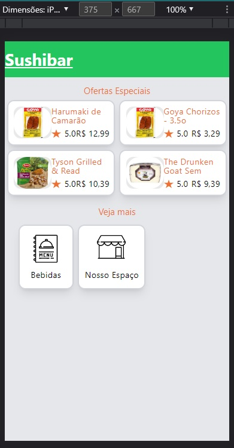
  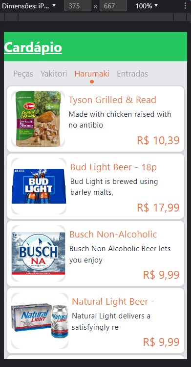
  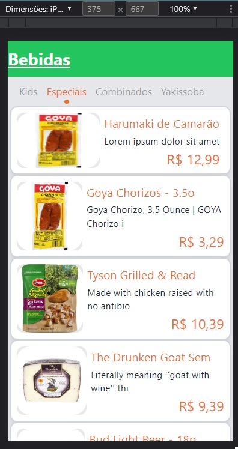
  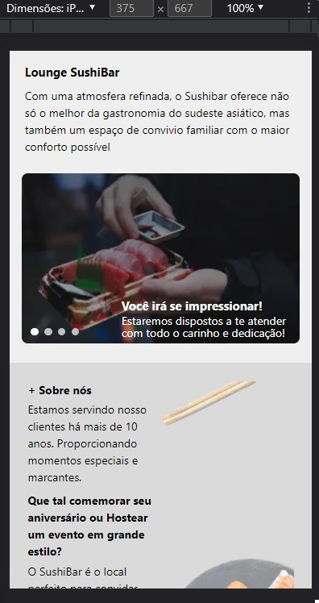
</p> 