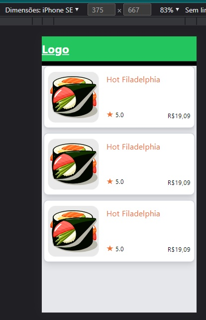

<h4 align="center">
	🍣 Sushibar 🚀
</h4>

<p align="center" style="display: flex; align-items: flex-start; justify-content: center;">
  
</p>

Site mobile-first de um restaurante japonês: destaques, cardápio por categoria, bebidas e a página "Nosso espaço" com reserva pelo WhatsApp. Layout no [Figma](https://www.figma.com/file/UiLvyL3UxGZt15t0IDcP80/Sushibar?node-id=0%3A1&t=zffdeG1GjpNHWrwe-0).

## Em produção

- URL: https://douglasabnovato.github.io/sushibar/
- Hospedagem: GitHub Pages (gratuito), publicado pelo GitHub Actions a cada push na `main`
- Passo a passo: [docs/DEPLOY.md](docs/DEPLOY.md)

## Stack

Next.js 16 (Pages Router, exportação estática) · React 19 · Tailwind CSS 3 · Supabase (opcional)

## Como executar

```bash
npm install
npm run dev     # http://localhost:3000
npm test
npm run build   # gera out/ (site estático publicado em /sushibar)
```

## De onde vem o cardápio

- Sem configuração: `data/menu.ts` (itens e preços ilustrativos — edite com os reais).
- Com Supabase: copie `.env.example` para `.env.local` e preencha `NEXT_PUBLIC_SUPABASE_URL` e `NEXT_PUBLIC_SUPABASE_ANON_KEY`. Tabelas: `categories (id, title)` e `products (id, title, description, price, main_image, category_id, featured)`. O cardápio é lido no build: depois de alterar o Supabase, rode o workflow de novo (Actions → CI → Run workflow). Se o Supabase falhar no build, o site usa o cardápio local.
- WhatsApp de reservas e aviso de demonstração: `lib/site.ts`.

## Qualidade (v1.0)

| Medida | Resultado |
|---|---|
| Lighthouse (mobile) | Desempenho 97 · Acessibilidade 100 · Boas práticas 96 · SEO 100 |
| axe-core (WCAG 2.2 AA) | 0 violações nas 5 páginas |
| `npm audit` | 0 vulnerabilidades |

Detalhes em [docs/ANALISE.md](docs/ANALISE.md), [docs/ARQUITETURA.md](docs/ARQUITETURA.md) e [docs/PLANO-DE-ACAO.md](docs/PLANO-DE-ACAO.md).

## Publicação gratuita

GitHub Pages: o site é exportado como HTML estático (`output: 'export'` em `next.config.js`) e publicado pelo workflow de CI. Se usar Supabase, cadastre as duas variáveis em Settings → Secrets and variables → Actions → **Variables**. Se o nome do repositório mudar, ajuste `repoBasePath` em `next.config.js`. Passo a passo em [docs/DEPLOY.md](docs/DEPLOY.md).
