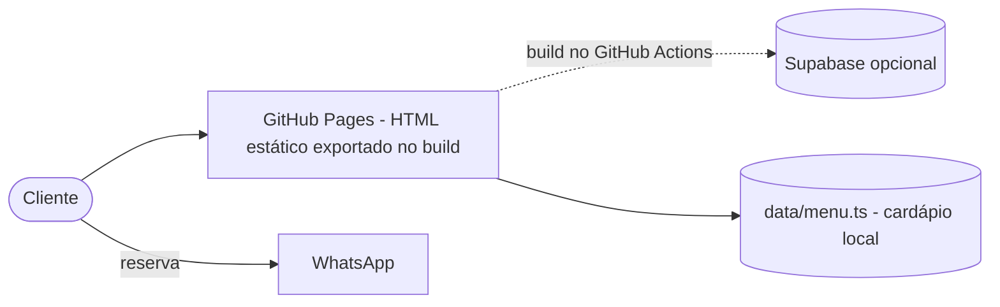
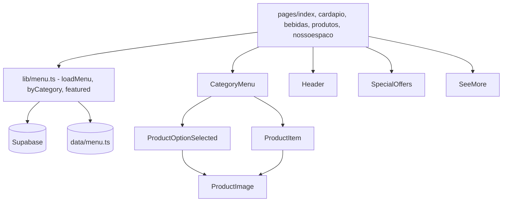

# Arquitetura — Sushibar

## ADRs

| # | Decisão | Motivo | Alternativa |
|---|---|---|---|
| ADR-01 | Manter Pages Router, subir para Next 16 | Menor mudança; o App Router não traria ganho aqui | Migrar para App Router |
| ADR-02 | Supabase opcional com fallback local | O site nunca fica fora do ar por falta de banco | Supabase obrigatório |
| ADR-03 | Remover dados raspados da Target | Não são do projeto e quebravam o build | Mover para fora de pages/ |
| ADR-04 | Sem nota de avaliação nos cards | Não havia avaliações reais | Integrar avaliações do Google |
